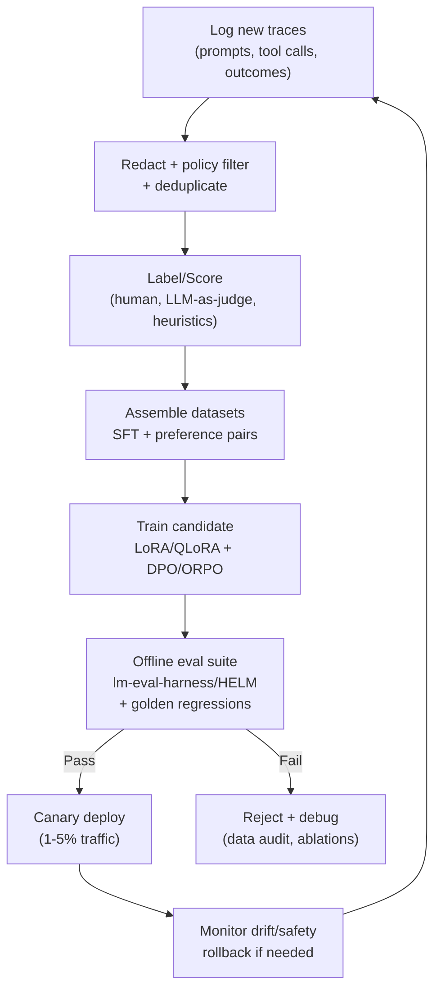

# Open Claw: Local LLM Deployment and Closed-Loop Auto-Researcher → Auto-Trainer System

## Executive summary

“Open Claw” (as interpreted here) is best designed as a **local LLM platform** that (a) reliably serves one or more open(-weight) models on-prem/desktop/edge, (b) **captures prompts, tool traces, and outcomes** into an auditable dataset, and (c) runs a **guardrailed retraining loop** (SFT/LoRA, preference tuning like DPO/ORPO, and optionally RLHF) driven by an **auto-researcher/agent** that proposes new data, tests hypotheses, and generates evaluation tasks—without sacrificing privacy, safety, or reproducibility.

A robust pattern is to standardize on an **OpenAI-compatible inference API** to decouple apps/agents from the underlying runtime: vLLM provides an OpenAI-compatible server for high-throughput GPU serving citeturn13search1turn0search5; Ray Serve LLM offers an OpenAI-compatible API aligned with vLLM while adding distributed deployment capabilities citeturn13search2turn10search3; and TGI exposes OpenAI-compatible endpoints like `/v1/chat/completions` plus Prometheus `/metrics` citeturn3search9turn3search5. For CPU-first and edge, llama.cpp focuses on local inference and supports quantization that shrinks model size (with some quality tradeoff), and is commonly paired with the GGUF format citeturn0search12turn0search0turn0search4.

For continuous improvement, the system should treat **captured outputs as “candidate training signals,” not automatically-trusted ground truth**. Recursive training on generated data can induce **model collapse** (degradation as synthetic data dominates), so Open Claw should (1) keep a clean human/verified anchor dataset, (2) label or score new samples with controlled evaluators, and (3) gate promotion via offline benchmarks and regression tests citeturn14search0turn14search4.

On the training side, the most practical local-first toolchains are **PEFT/LoRA** (parameter-efficient tuning) citeturn6search3turn1search0 and **QLoRA** (LoRA on a 4-bit quantized base model), which was introduced to drastically reduce finetuning memory and demonstrated finetuning a 65B model on a single 48GB GPU in the original paper citeturn11search2. For preference alignment, **DPO** is a widely-adopted simpler alternative to PPO-based RLHF, avoiding an explicit RL loop and reward model in the standard formulation citeturn6search2. Practically, you can implement these methods with **Hugging Face TRL** (SFT/DPO and more) citeturn0search7turn0search3, **Axolotl** (opinionated finetuning pipeline supporting LoRA/QLoRA, DPO/ORPO, GRPO, etc.) citeturn1search5turn1search1, or **AutoTrain Advanced** for a more guided “train and deploy” experience (supports SFT/DPO/ORPO and local training) citeturn0search2turn0search14.  

Operationally, the platform should include: (a) an immutable log store + dataset versioning (e.g., **Delta Lake tables** with transaction log “time travel” semantics citeturn1search7turn1search11 and/or **DVC** for Git-like data/model versioning citeturn1search2turn1search6), (b) observability (Prometheus exposition format citeturn4search3 + OpenTelemetry for traces/metrics/logs citeturn8search2 + Loki for logs citeturn8search3), and (c) a GitOps-style model rollout pipeline (Argo CD citeturn9search0 or Flux citeturn9search1).

## Assumptions and design targets

Because you did not specify scale/OS/budget, this report assumes:

1. **Operating environments**
   - Desktop/workstation: one machine (Linux/Windows/macOS), optionally with a single NVIDIA GPU (or Apple Silicon unified memory), serving 1–3 concurrent users.
   - On-prem: small cluster (3–10 nodes) with 1–8 GPUs total.
   - Edge: one device (e.g., Jetson-class) running a small quantized model for low-latency, offline inference.

2. **Workload**
   - Primary usage: chat + tool-using agent workflows (auto-researcher) + periodic offline batch generation for dataset expansion.
   - Latency target: “interactive” for chat on workstation (seconds for first token acceptable), throughput scaling on-prem.

3. **Data**
   - Prompts/responses may contain sensitive IP/PII; logs must remain local and access-controlled.
   - You want **closed-loop retraining** but can accept **human-in-the-loop** (HITL) for final promotion decisions.

4. **Budget**
   - Unspecified; roadmap includes low/medium/high scenarios.

5. **Constraint**
   - Prefer open(-weight) models and open-source infra; acknowledge that “open-weight” licenses differ (e.g., Apache 2.0 vs community licenses) citeturn2search6turn2search12turn2search5turn2search3.

## Reference architecture for Open Claw

The architecture below is the recommended end-to-end pattern: **one standardized inference API**, **structured capture**, **dataset curation/versioning**, **trainer**, **evaluator**, and **controlled rollout**.

```mermaid
flowchart LR
  subgraph Clients["Clients"]
    A1["Chat/UI"]
    A2["Internal Apps"]
    A3["CI Bench Runner"]
  end

  subgraph Gateway["Inference Gateway (OpenAI-compatible)"]
    G1["API Router / Auth / Rate Limits"]
    G2["Request/Response Logger\n(trace IDs, token counts, tool calls)"]
  end

  subgraph Serving["Model Serving (local)"]
    S1["GPU Serving: vLLM or TGI\n(OpenAI endpoints)"]
    S2["CPU/Edge: llama.cpp / Ollama\n(GGUF quant)"]
    S3["Optional: OpenVINO GenAI\n(PC/CPU/iGPU/NPU)"]
  end

  subgraph AgentLayer["Auto-Researcher / Agent Layer"]
    R1["Agent Framework\n(AutoGen / LangChain / LlamaIndex)"]
    R2["Tool Connectors\n(MCP servers, internal APIs)"]
    R3["Sandbox Executor\n(gVisor/Kata/Firecracker)"]
  end

  subgraph DataPlane["Data Plane"]
    D1["Event Bus\n(NATS/Kafka/Redis Streams)"]
    D2["Immutable Log Store\n(JSONL/Parquet in S3/MinIO)"]
    D3["Curate/Redact/Dedup\nPII + policy filters"]
    D4["Dataset Tables\n(Delta Lake)"]
    D5["Dataset Versioning\n(DVC + Git tags)"]
  end

  subgraph TrainEval["Train + Evaluate"]
    T1["Trainer\n(Axolotl or TRL or AutoTrain)\nLoRA/QLoRA + DPO/ORPO"]
    T2["Experiment Tracking + Registry\n(MLflow)"]
    E1["Offline Eval Harness\n(lm-eval-harness / HELM)\n+ task suites"]
    E2["Gating + Promotion Rules\n(regressions, safety, drift)"]
  end

  subgraph Deploy["Deployment + Ops"]
    P1["Orchestration\n(Docker Compose / systemd / Kubernetes)"]
    P2["Observability\nPrometheus + OpenTelemetry + Loki/Grafana"]
    P3["GitOps Rollout\nArgo CD / Flux"]
  end

  Clients -->|OpenAI-style requests| Gateway
  Gateway --> Serving
  Serving -->|responses + metrics| Gateway
  Gateway --> DataPlane

  AgentLayer -->|calls models/tools| Gateway
  AgentLayer --> DataPlane

  DataPlane --> TrainEval
  TrainEval -->|new model artifacts| Deploy
  Deploy --> Serving
```



**Key architectural choices (why they matter)**  
A single OpenAI-compatible “front door” makes the rest of the system composable. vLLM explicitly provides an HTTP server implementing OpenAI APIs citeturn13search1; Ray Serve LLM offers an OpenAI-compatible API aligned with vLLM’s server for distributed deployment citeturn13search2; and TGI includes `/v1/chat/completions` and Prometheus `/metrics` citeturn3search9turn3search5. For workstation/edge, llama.cpp provides local inference and a quantization workflow that reduces model size (with tradeoffs) citeturn0search12turn0search0.

**Deployment archetypes**
- **Desktop/workstation (fastest path):** Docker Compose with a single serving backend (Ollama/llama.cpp for CPU-first or vLLM/TGI for GPU), Postgres + object storage, and a lightweight trainer runner. Compose startup ordering can be managed with `depends_on` + healthchecks citeturn4search1.
- **On-prem (most scalable):** Kubernetes with GPU scheduling through device plugins citeturn4search0turn4search4turn4search8, separate namespaces for serving/training, and GitOps (Argo CD citeturn9search0 or Flux citeturn9search1).
- **Edge (privacy/offline-first):** Quantized small models (GGUF or other low-bit formats) and strict resource caps; for example, Jetson Orin Nano Super dev kit is positioned for running generative AI on small edge devices and is marketed at up to 67 TOPS citeturn11search1.

## Component choices and comparison table

The table below compares **8 key component slots** (meeting your “6–8” request) with recommended options, alternatives, and maturity.

| Layer / Slot | Recommended component | Strong alternatives | Pros | Cons / watchouts | Maturity |
|---|---|---|---|---|---|
| Base model family | **Mixtral 8x7B (Apache 2.0)** citeturn2search6 or **Gemma (Apache 2.0 repo)** citeturn2search3 | Llama 3.1 (community license) citeturn2search12turn2search4; Qwen2.5 (Qwen license + tech report) citeturn2search5turn2search1 | Apache-2.0 options simplify commercial/on-prem use; strong model quality per vendor announcements/positioning citeturn2search6turn2search11 | Non-Apache licenses (Llama/Qwen) require careful compliance review citeturn2search12turn2search5 | High (models widely deployed) |
| GPU serving runtime | **vLLM** (PagedAttention; OpenAI server) citeturn0search5turn13search1 | TGI citeturn3search5turn3search9; TensorRT‑LLM citeturn3search14turn3search2; Ray Serve LLM citeturn10search3turn13search2 | High throughput, efficient KV-cache memory mgmt via PagedAttention citeturn0search5; OpenAI-compatible API citeturn13search1 | GPU-centric; quantization matrix varies by hardware and format citeturn12search0turn3search14 | High |
| CPU/edge runtime | **llama.cpp (GGUF)** citeturn0search12turn0search4 | Ollama API layer citeturn3search0turn3search8; OpenVINO GenAI citeturn3search3turn3search7 | Quantization reduces size and can speed inference citeturn0search0; broad portability | Throughput lower than GPU; model size limited by RAM; quantization can reduce quality citeturn0search0turn3search2 | High |
| Inference gateway / routing | **LiteLLM proxy** (OpenAI format gateway + logging features) citeturn15search8turn15search0 | Custom FastAPI gateway; BentoML (OpenAI-compatible serving) citeturn15search1turn15search9 | Standardizes auth/routing, can unify Ollama/vLLM endpoints citeturn15search0turn15search8 | Extra hop + config surface; treat as critical security boundary | High |
| Orchestration | **Docker Compose (workstation)** citeturn4search1 and **Kubernetes (on-prem)** citeturn4search0 | systemd service units (single host) citeturn4search14; KServe for Kubernetes-native serving citeturn15search2turn15search6 | Compose is simplest; K8s handles GPUs + scaling with device plugins citeturn4search0turn4search8 | K8s overhead; systemd best for single binary/host only | High |
| Trainer pipeline | **Axolotl** (LoRA/QLoRA; DPO/ORPO/GRPO) citeturn1search5turn1search9 | TRL citeturn0search7turn0search3; AutoTrain Advanced (SFT/DPO/ORPO) citeturn0search2turn0search14; OpenRLHF (Ray/vLLM/DeepSpeed) citeturn6search0turn6search4 | Axolotl is an end-to-end finetuning “workbench”; TRL is flexible library; OpenRLHF scales complex RLHF citeturn6search4 | Complex RLHF adds operational risk; ensure strict gating on “auto-trained” outputs citeturn6search2turn14search0 | Medium–High |
| Dataset/versioning store | **Delta Lake tables** citeturn1search7turn1search11 + **DVC** citeturn1search2turn1search6 | lakeFS (if needed), “plain” Parquet + Git LFS | Delta provides transaction log history + Parquet; DVC adds Git-like versioning for data/models citeturn1search7turn1search6 | Delta ecosystem adds complexity; DVC requires discipline and remote storage | High |
| Observability | **Prometheus + OpenTelemetry + Loki/Grafana** citeturn4search3turn8search2turn8search3 | ELK stack; vendor APMs | Prometheus text exposition standard citeturn4search3; OTel is vendor-neutral for traces/metrics/logs citeturn8search2; Loki is scalable log aggregation inspired by Prometheus citeturn8search3 | Needs careful labeling + retention policies | High |

## Deployment and integration plan with commands and config snippets

This plan is staged: **prototype on one box**, then **harden**, then **scale to on-prem**, then **extend to edge**. Snippets are intentionally short (no full-length code).

### Stepwise plan

**Step A: Choose your “front door” API and serving backend**
- If you have an NVIDIA GPU and want throughput: start with vLLM’s OpenAI-compatible server citeturn13search1turn0search5.
- If you’re CPU-first or need maximal portability: start with llama.cpp GGUF (optionally via Ollama) citeturn0search12turn3search0.
- If you want PC/laptop optimization across devices: evaluate OpenVINO GenAI citeturn3search3turn3search7.

**Step B: Prototype “workstation Open Claw” using Docker Compose**
1) Minimal Compose skeleton (conceptual snippet):

```yaml
# compose.yaml (snippet)
services:
  llm:
    image: vllm/vllm-openai:latest
    command: ["vllm", "serve", "MODEL_ID", "--host", "0.0.0.0", "--port", "8000"]
    deploy:
      resources:
        reservations:
          devices: [{ capabilities: ["gpu"] }]
  gateway:
    image: ghcr.io/berriai/litellm:latest
    environment:
      - LITELLM_ROUTER_CONFIG=/config/router.yaml
    depends_on:
      llm:
        condition: service_started
  prometheus:
    image: prom/prometheus:latest
```

Compose dependency ordering should be done with healthchecks where possible; Docker documents controlling startup order using `depends_on` + `healthcheck` citeturn4search1.

2) Start the stack:
```bash
docker compose up -d
docker compose ps
```

**Step C: Standardize inference calls (OpenAI-compatible)**
- vLLM explicitly supports an OpenAI-compatible HTTP server citeturn13search1.
- TGI also exposes OpenAI-style endpoints and a `/metrics` endpoint citeturn3search9.
- Ollama has its own REST API (e.g., `POST /api/generate`) and returns useful timing/token counts that you can log citeturn3search0.

Example `curl` call (OpenAI-style) against vLLM/TGI:
```bash
curl http://localhost:8000/v1/chat/completions \
  -H "Content-Type: application/json" \
  -d '{"model":"MODEL_ID","messages":[{"role":"user","content":"Ping"}]}'
```

**Step D: Capture outputs into an auditable event stream**
Implement capture at the gateway (preferred) so every tool/agent and user call is logged once.

Recommended event schema (minimum):
- `trace_id`, `request_id`, `user/session tags`
- prompt/messages (with redaction flags)
- tool calls + tool outputs (separate, access-controlled)
- response text
- token counts/latencies (`prompt_eval_count`, `eval_count`, etc. if available) citeturn3search0
- model version hash + quantization/runtime metadata

**Step E: Persist to object storage + dataset tables + versioning**
- **Delta Lake** stores data in Parquet plus a transaction log (supports history/time travel patterns) citeturn1search7turn1search11.
- **DVC** provides Git-like version control for data/models/experiments and can store large data externally while keeping version metadata in Git citeturn1search6.

DVC quickstart snippet:
```bash
git init
dvc init
dvc add data/openclaw_logs/ # e.g., JSONL or Parquet batches
git add data/openclaw_logs.dvc .dvc/config
git commit -m "Track Open Claw logs dataset"
dvc remote add -d storage s3://openclaw-dvc
dvc push
```

**Step F: Generate training datasets (SFT + preference pairs)**
Create two pipelines:

1) **SFT dataset builder**
   - Take successful traces (high outcome score, passes policy, no PII).
   - Convert to chat template (system/user/assistant).
   - Deduplicate and stratify.

2) **Preference dataset builder (for DPO/ORPO)**
   - For each prompt/task, produce `(chosen, rejected)` responses.
   - Sources:
     - Human votes (best).
     - LLM-as-judge for bootstrapping (must be gated); MT-Bench introduced scalable LLM-as-judge evaluation and highlights biases/limitations citeturn7search2.

**Step G: Train with LoRA/QLoRA + preference tuning**
Options:

- **Axolotl** supports a wide menu: LoRA/QLoRA, preference tuning (DPO/ORPO), RL methods like GRPO, and reward modeling citeturn1search5.
- **TRL** is a library for SFT/DPO/GRPO and post-training in the Transformers ecosystem citeturn0search7turn0search3.
- **AutoTrain Advanced** supports SFT/DPO/ORPO and local training workflows citeturn0search2.

Axolotl training snippet (conceptual):
```yaml
# train.yaml (snippet)
base_model: meta-llama/Llama-3.1-8B-Instruct
adapter: lora
load_in_4bit: true   # QLoRA-style
datasets:
  - path: data/sft.jsonl
    type: chat_template
rl: null
```

Run:
```bash
python -m axolotl.cli.train train.yaml
```

If you adopt QLoRA, the original paper demonstrated finetuning a 65B model on a single 48GB GPU (a helpful upper bound for local planning) citeturn11search2.

**Step H: Evaluate before promotion**
Use both:
- **Task/benchmark harness:** lm-evaluation-harness provides a unified framework to test models on many tasks citeturn7search0; HELM provides holistic evaluation framework and leaderboards concept citeturn7search1turn7search5.
- **Regression suite:** your own golden prompts + safety/policy tests (especially for tool-using agents).

lm-eval-harness snippet:
```bash
lm_eval --model hf \
  --model_args pretrained=OUTPUT_MODEL_ID \
  --tasks mmlu,hellaswag \
  --output_path eval/results.json
```

**Step I: Controlled rollout**
- Store artifacts and lineage in **MLflow** (tracking + model registry) citeturn9search2turn9search10.
- Roll out with GitOps:
  - **Argo CD** is a declarative GitOps CD tool for Kubernetes citeturn9search0.
  - **Flux** keeps clusters in sync with Git sources citeturn9search1.

**Step J: Scale up to Kubernetes (on-prem)**
- Kubernetes supports scheduling GPUs through device plugins citeturn4search0turn4search4.
- NVIDIA’s Kubernetes device plugin is a DaemonSet that exposes GPUs, tracks health, and enables GPU-enabled containers citeturn4search8.

GPU resource request snippet:
```yaml
resources:
  limits:
    nvidia.com/gpu: 1
```

**Step K: Add agent sandboxing**
If your auto-researcher executes model-generated code, isolate it:
- gVisor provides an application-kernel approach to add isolation for untrusted/LLM-generated code citeturn8search0turn8search8.
- Firecracker provides microVM isolation with hardware virtualization properties citeturn8search1turn8search13.
- Kata Containers provides VM-backed containers (“stronger workload isolation using hardware virtualization”) citeturn15search11.

**Step L: Optional “tool protocol” standardization**
Adopt MCP (Model Context Protocol) for consistent tool/data connectors. MCP is an open protocol to integrate LLM apps with external tools/data sources via a standardized interface citeturn13search3turn13search11. AutoGen documentation also references MCP tooling (e.g., “McpWorkbench”) citeturn5search4turn5search0.

## Operations, security, evaluation loop, risks, and roadmap

### Monitoring, logging, and CI/CD essentials

**What to measure (minimum)**
- Inference SLOs: time-to-first-token, tokens/sec, queue depth, error rates.
- Data pipeline health: ingestion lag, redaction failure rate, dedup ratio.
- Training: GPU utilization, step time, loss curves, eval metrics.
- Drift: win-rate vs baseline, domain-specific accuracy, safety regressions.

**Telemetry stack**
- Prometheus expects a text exposition format by default citeturn4search3; TGI includes a Prometheus `/metrics` endpoint citeturn3search9.
- OpenTelemetry is vendor-neutral for collecting and exporting traces/metrics/logs citeturn8search2.
- Loki is a horizontally-scalable log aggregation system inspired by Prometheus citeturn8search3.

**CI/CD**
- Use GitOps to promote model deployments only after evaluation gates pass:
  - Argo CD for GitOps CD citeturn9search0 or Flux for Git-to-cluster sync citeturn9search1.
- Treat model artifacts like software supply chain items; SLSA is a checklist framework for supply-chain integrity citeturn9search3 (useful for signing/attesting model builds).

### Evaluation and automated retraining loop design

A safe closed-loop retraining design needs explicit “stop/go” gates.



**Why this gating is non-negotiable**
- Training on generated data recursively can cause irreversible defects (“model collapse”) citeturn14search0turn14search4.
- Preference optimization methods like **DPO** simplify alignment compared to RLHF pipelines but still require high-quality preference data citeturn6search2.

### Compute estimates and hardware recommendations

These are practical planning heuristics based on widely-used quantization/training approaches:

**Inference memory (rule of thumb)**
- Weight memory ≈ `#params × bits/8`.  
  Example: 8B at 4-bit ≈ 4 GB (plus runtime overhead + KV cache). Quantization reduces model size and can speed inference, but may reduce quality citeturn0search0turn3search2.

**Serving choices**
- **CPU-only:** small models (3B–8B) in GGUF 4-bit; llama.cpp quantize tooling exists specifically to convert GGUF to lower precision citeturn0search0turn0search4.
- **Single GPU (24GB):** strong for 7B–13B at FP16/BF16 or larger at 4–8 bit; vLLM’s attention memory optimizations improve throughput efficiency citeturn0search5turn13search1.
- **Edge:** Jetson Orin-class devices can run popular generative models on-device; Jetson Orin Nano Super is marketed for small edge generative AI up to 67 TOPS citeturn11search1.

**Training (local)**
- **PEFT/LoRA:** reduces trainable params by injecting low-rank adapters while freezing base weights citeturn6search3turn6search15.
- **QLoRA:** enables finetuning large models with much lower memory by finetuning LoRA adapters on top of a 4-bit base; the QLoRA paper highlights finetuning a 65B model on a single 48GB GPU citeturn11search2.

**Quantization tradeoffs**
- Quantization trades precision for memory footprint; vLLM documents this tradeoff citeturn12search0.
- TensorRT-LLM documentation describes quantization as a way to boost throughput/latency at acceptable quality tradeoff, including FP8/INT8/FP4 methods citeturn3search2turn3search14.
- AWQ is designed for low-bit weight-only quantization for on-device LLMs and emphasizes on-device deployment needs citeturn11search3turn11search7.

### Security, privacy, and sandboxing

**Frameworks to align with**
- NIST AI RMF provides a structured approach to AI risk management and is explicitly intended to be a living document with periodic review citeturn14search2turn14search14.
- OWASP Top 10 for LLM Applications (2025) provides a risk taxonomy (e.g., prompt injection, data leakage) citeturn14search3.

**Core controls for Open Claw**
- **Data minimization and redaction:** store raw prompts/tool outputs only when necessary; separate “sensitive tool outputs” from general chat logs.
- **Sandbox tool execution:** run any model-generated code in isolated runtimes:
  - gVisor targets stronger isolation for untrusted/LLM-generated code in containerized environments citeturn8search0turn8search8.
  - Firecracker microVMs provide VM isolation with low overhead citeturn8search1turn8search13.
  - Kata Containers provides VM-backed containers citeturn15search11.
- **Network egress control:** default-deny egress for agent sandboxes; explicitly allow only required endpoints.
- **Prompt-injection resilience:** treat external tool outputs/web content as untrusted; enforce strict tool schemas; prefer protocol-based tool integration (MCP) for structured tool invocation citeturn13search3turn13search11.
- **Dataset poisoning defense:** poisoning is a recognized threat class; modern surveys emphasize that training data quality and security critically affect reliability citeturn14search1. Require provenance + quarantine + review for high-impact samples.

### Risk assessment and mitigation plan

**Risk: Model collapse from recursive self-training**
- Why: training on generated data can cause distribution tails to disappear over generations citeturn14search0turn14search4.
- Mitigation: maintain a clean anchor dataset; cap synthetic proportion; require offline eval + canary before promotion.

**Risk: Data poisoning of the retraining corpus**
- Why: attackers (or accidental failures) can insert malicious examples; surveys highlight poisoning as a major deep learning threat citeturn14search1.
- Mitigation: provenance tracking (signed ingestion), anomaly detection, manual review for high-leverage samples, strict dataset versioning (DVC) citeturn1search6.

**Risk: Prompt injection leading to tool misuse / data exfiltration**
- Why: documented as a top class of LLM app risks (OWASP). citeturn14search3
- Mitigation: sandbox tools (gVisor/Firecracker/Kata) citeturn8search8turn8search1turn15search11, least-privilege credentials, strict tool schemas, egress control.

**Risk: License non-compliance for model weights**
- Why: some popular models use community or custom licenses rather than Apache-2.0 citeturn2search12turn2search5turn2search6.
- Mitigation: maintain a “model license bill of materials,” pin approved models, automate checks in CI before rollout.

**Risk: Operational complexity / unreproducible experiments**
- Mitigation: use MLflow tracking and model registry citeturn9search2turn9search10; use GitOps (Argo CD/Flux) citeturn9search0turn9search1; version datasets via DVC citeturn1search6.

**Risk: Observability gaps hide regressions**
- Mitigation: standardize metrics (Prometheus exposition) citeturn4search3; instrument with OpenTelemetry citeturn8search2; centralize logs with Loki citeturn8search3.

### Minimal prototype roadmap with low/medium/high scenarios

Time assumes a small engineering team (1–3 people) and local-first deployment.

**Milestone 1: Local serving + OpenAI-compatible API (Week 1–2)**
- Deliverables: model server (vLLM or llama.cpp/Ollama), gateway routing, basic logging.
- Low: CPU-only llama.cpp + GGUF quantization citeturn0search0turn0search4.  
- Medium: single GPU + vLLM OpenAI server citeturn13search1turn0search5.  
- High: multi-GPU node + vLLM/TensorRT‑LLM evaluation citeturn3search14turn13search1.

**Milestone 2: Data capture → curated dataset v0 (Week 2–4)**
- Deliverables: structured schema, redaction/dedup, Delta table + DVC version tags citeturn1search7turn1search6.
- Budget:
  - Low: filesystem + DVC.
  - Medium: MinIO/S3 + Delta + DVC.
  - High: multi-tenant lake + stricter governance and retention.

**Milestone 3: Auto-researcher agent + sandboxed tools (Week 4–6)**
- Deliverables: agent framework (AutoGen / LangChain / LlamaIndex), tool connectors (MCP), sandbox runtime.
- Notes: AutoGen supports multi-agent application patterns and provides tool execution integrations (e.g., Docker-based executors) citeturn5search0turn5search4; MCP standardizes tool/data integration citeturn13search3turn13search11.
- Security: adopt gVisor or Firecracker/Kata for untrusted code citeturn8search8turn8search1turn15search11.

**Milestone 4: Train loop v0 (LoRA/QLoRA SFT) + evaluation gates (Week 6–10)**
- Deliverables: LoRA/QLoRA training pipeline (Axolotl/TRL), offline eval suite (lm-eval-harness/HELM), publish artifacts to MLflow registry citeturn1search5turn0search3turn7search0turn9search10.
- Budget scenarios:
  - Low: 7B–8B LoRA/QLoRA on a single consumer GPU or rented short bursts.
  - Medium: 1× 24–48GB GPU; QLoRA-based finetunes; more frequent retrains citeturn11search2.
  - High: multi-GPU (distributed) + preference tuning at scale (OpenRLHF) citeturn6search4turn6search0.

**Milestone 5: Preference tuning v1 (DPO/ORPO) + canary rollout (Week 10–14)**
- Deliverables: preference data generation + DPO training; canary release; rollback automation.
- Rationale: DPO is a simpler preference-based alignment method than PPO-based RLHF citeturn6search2.
- Guardrail: cap synthetic data to avoid model collapse dynamics citeturn14search0turn14search4.

**Milestone 6: On-prem Kubernetes + GitOps + full observability (Week 14–20)**
- Deliverables: K8s manifests, GPU scheduling, Prometheus/OTel/Loki, Argo CD/Flux GitOps.
- K8s GPU scheduling uses device plugins; NVIDIA device plugin exposes GPUs and monitors health citeturn4search0turn4search8.
- GitOps with Argo CD or Flux citeturn9search0turn9search1.

### Selected primary sources (URLs in code for quick access)

```text
vLLM (OpenAI server): https://docs.vllm.ai/en/latest/serving/openai_compatible_server/
vLLM paper (PagedAttention): https://arxiv.org/pdf/2309.06180
llama.cpp: https://github.com/ggml-org/llama.cpp
llama.cpp quantization README: https://github.com/ggml-org/llama.cpp/blob/master/tools/quantize/README.md
TGI: https://github.com/huggingface/text-generation-inference
TGI API (OpenAI endpoints + /metrics): https://huggingface.github.io/text-generation-inference/
Axolotl docs: https://docs.axolotl.ai/
TRL: https://huggingface.co/docs/trl/index
PEFT: https://huggingface.co/docs/peft/index
AutoTrain Advanced (LLM finetuning): https://huggingface.co/docs/autotrain/en/tasks/llm_finetuning
DVC docs: https://doc.dvc.org/
Delta Lake getting started: https://delta.io/learn/getting-started/
Prometheus exposition format: https://prometheus.io/docs/instrumenting/exposition_formats/
OpenTelemetry docs: https://opentelemetry.io/docs/
Loki overview: https://grafana.com/docs/loki/latest/get-started/overview/
Argo CD: https://argo-cd.readthedocs.io/
Flux: https://fluxcd.io/flux/
NIST AI RMF 1.0 PDF: https://nvlpubs.nist.gov/nistpubs/ai/NIST.AI.100-1.pdf
OWASP Top 10 for LLM Apps (2025) PDF: https://owasp.org/www-project-top-10-for-large-language-model-applications/assets/PDF/OWASP-Top-10-for-LLMs-v2025.pdf
Model Context Protocol (spec): https://modelcontextprotocol.io/specification/2025-03-26
```