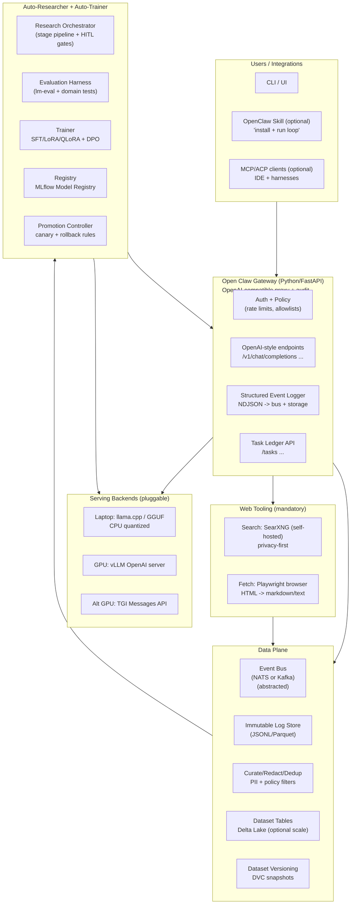
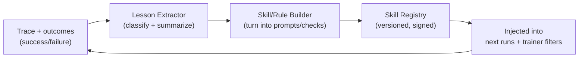

# Open Claw Greenfield Build Guide for an Agent

## Guiding principles and non-negotiable preferences

This guide is written as **agent-executable build instructions** for a greenfield “self-sustaining, growing machine” that can run in a **degraded laptop mode** (old Intel MacBook Pro: CPU-only, single-node, minimal services) while scaling cleanly to **modern on-prem/Kubernetes** with GPU inference and scheduled retraining.

### Hard preferences

**Language + runtime**
- **Python 3.11+ as the primary implementation language** for the control plane (gateway), agent runtime, data pipeline, and trainer integration, because (a) training/eval stacks are Python-native, and (b) proven agent platforms like Hermes Agent are Python-heavy and ship production-grade patterns (tool registry, gateway, SQLite session store, multiple backends). citeturn4view0turn2view1  
- **Use `uv` for Python env + dependency management**, mirroring modern practices in agent/research repos (Hermes Agent contributor workflow uses `uv`; Karpathy’s autoresearch uses `uv run ...`). citeturn2view1turn7view0turn7view1  
- Keep “optional polyglot” only where it adds distinct value (e.g., model serving uses external runtimes like vLLM/TGI/llama.cpp). vLLM exposes an OpenAI-compatible HTTP server (`vllm serve ...`). citeturn15search0  

**Design pattern**
- **Event-sourced, ledger-first architecture**: everything important becomes an immutable event (prompt, tool call, response, outcome, eval score, dataset version, training run).  
- **Ports-and-adapters (hexagonal)**: define strict interfaces for “LLM backend”, “web search”, “browser fetch”, “storage”, “trainer”, “evaluator”. Swap implementations per environment without touching core logic.
- **Deterministic workflows with explicit approvals + resumption tokens** for side-effectful automation, reflecting OpenClaw’s Lobster philosophy (typed pipeline spec, approvals, resumable state). citeturn10view2  
- **Task ledger, not a scheduler**: model long-running work as tasks with status transitions and audits, similar to OpenClaw’s Background Tasks (records detached work; states like `queued → running → terminal`; CLI can list/audit/cancel). citeturn12view1  

**Tooling + standards**
- **API contracts first**: OpenAPI for HTTP services, JSON Schema for events/config.  
- **Strict formatting/linting/tests**: `ruff`, `mypy`, `pytest`, `pre-commit`.  
- **Reproducible data + model lineage**: DVC for Git-like dataset/model versioning. citeturn17search0turn17search4  
- **Model registry**: MLflow Model Registry for lineage, versioning, metadata. citeturn17search2  
- **Metrics**: Prometheus exposition format and standard `/metrics`. citeturn17search3  

**Security defaults**
- Assume all tool execution is untrusted. Provide **approval gates** and **container isolation** patterns (Hermes Agent documents dangerous command approval modes and hardened Docker flags). citeturn5view0turn5view1  
- Require **web tooling** (search + fetch) but keep it constrained: SSRF protection, deny-by-default egress in sandbox, allowlists for sensitive environments.

### Compatibility goals

**Laptop mode (old Intel MacBook Pro)**
- CPU-only inference via llama.cpp GGUF quantization workflow (quantization reduces precision, shrinks size, often speeds inference, with potential accuracy loss). citeturn15search2  
- Single-node storage: SQLite for state + local filesystem for artifacts.

**Scale mode (Kubernetes/on-prem)**
- GPU inference via **vLLM OpenAI-compatible server**. citeturn15search0  
- Optional alternate serving: **TGI Messages API (OpenAI Chat Completion compatible)** and Prometheus `/metrics`. citeturn15search1turn15search9  
- GPU scheduling via NVIDIA’s Kubernetes device plugin (DaemonSet that exposes GPUs, tracks health, runs GPU-enabled pods). citeturn15search3  
- GitOps delivery via Argo CD (Git as source of truth). citeturn14search3turn14search15  

## System blueprint and contracts

### The greenfield “self-growing machine” loop

This blueprint merges ideas seen in:
- **AutoResearchClaw**: a multi-phase pipeline with explicit gate stages + HITL modes, plus ACP support for running “coding harness” backends through persistent sessions. citeturn6view1turn6view3  
- **OpenClaw**: gateway control plane + tasks ledger + deterministic workflow shell (Lobster) + ACP bridging and ACP harness sessions. citeturn12view0turn12view1turn10view1turn10view3  
- **Hermes Agent**: a large, production-agent architecture map (agent loop, tool registry, gateway, SQLite session store, multiple tool backends) and strong operational security patterns. citeturn4view0turn5view1  
- **Karpathy/autoresearch**: “program.md as agent instructions” and iterative experiment logging discipline. citeturn7view0turn7view1  
- **ZeroClaw**: AGENTS.md as a cross-tool instruction format with commands, risk tiers, repo map, and extension points. citeturn9view0  

### Recommended architecture diagram



### Core contracts the agent must implement first

Define these as versioned JSON Schemas from day one (store under `contracts/` and publish snapshots):
- `ClawEvent`: immutable event envelope `{event_id, ts, trace_id, type, payload, pii_flags, hashes, provenance}`  
- `Task`: task ledger record `{task_id, status, runtime, parent_task_id, trace_id, created_at, updated_at, terminal_reason}` (mirror OpenClaw’s “tasks are records” behavior). citeturn12view1  
- `Trace`: prompt/messages + tool calls + model backend metadata + timing/token counts (when available).
- `DatasetVersion`: `{dataset_id, dvc_rev, delta_version?, sample_counts, filters_applied, label_policy, created_at}`
- `TrainingRun`: `{run_id, base_model, adapter_type, method (SFT/DPO), data_version, eval_report, artifacts_uri, decision}`
- `EvalReport`: `{suite_versions, metrics, regressions, safety_flags, win_rate}`

## Agent-executable step-by-step build plan

This is the actual “do this next” guide. It is intentionally formatted like an `AGENTS.md` / `program.md` hybrid so you can paste it into your repo and hand it to an autonomous builder.

### Phase zero: create the repo as an agent-friendly workspace

**Deliverables**
- A new Git repository with: `LICENSE` (MIT or Apache-2.0), `AGENTS.md`, `CONTRIBUTING.md`, `SECURITY.md`, `.gitignore`, `.pre-commit-config.yaml`.
- A “single command” developer workflow file: `justfile` or `Makefile` (choose one).

**Agent instructions template**
- Model it after ZeroClaw’s `AGENTS.md`: include commands, repo map, risk tiers, and “anti-patterns”. citeturn9view0  
- Add a dedicated file `PROGRAM_BUILD.md` in the style of Karpathy’s `program.md`: strict constraints, iteration loop, rules for logging decisions. citeturn7view0turn7view1  

**Commands to implement**
```bash
uv venv --python 3.11
source .venv/bin/activate
uv pip install -e ".[dev]"
pre-commit install
ruff check .
pytest -q
```

**Acceptance criteria**
- `ruff`, `mypy`, `pytest` pass in CI on each commit.
- Agent instructions clearly state: “No new dependencies without justification.”

### Phase one: scaffold the monorepo layout and interfaces

**Preferred repo layout**
```text
openclaw-loop/
  AGENTS.md
  PROGRAM_BUILD.md
  pyproject.toml
  contracts/
    claw_event.schema.json
    task.schema.json
    trace.schema.json
  services/
    gateway/
    orchestrator/
    trainer/
  libs/
    core/           # domain logic, no IO
    adapters/       # IO implementations
    sdk/            # client SDK (optional)
  infra/
    compose/
    k8s/
  data/
    README.md       # local dev datasets (ignored by git)
  docs/
```

**What to build**
- Implement `libs/core` as pure Python domain logic (no FastAPI, no DB drivers).
- Implement `libs/adapters` for: storage, event bus, inference backends, web tooling.

**Acceptance criteria**
- All schemas in `contracts/` have unit tests validating sample payloads.
- Every external integration is behind an interface so laptop mode can swap implementations.

### Phase two: build the Gateway (OpenAI-compatible proxy + audit + task ledger)

**Why this first**
Everything else (researcher, trainer, evaluation) depends on a stable, logged inference + tool boundary. OpenClaw’s architecture emphasizes “Gateway is the control plane.” citeturn12view0  

**Gateway features (minimum)**
- OpenAI-style endpoints subset:
  - `POST /v1/chat/completions` (proxy)
  - `GET /healthz`
  - `GET /metrics` (Prometheus exposition)
- Request routing to model backends:
  - **vLLM server** in scale mode (`vllm serve ...` serves OpenAI APIs). citeturn15search0  
  - **TGI Messages API** as alternate backend (OpenAI Chat Completion compatible). citeturn15search1turn15search9  
  - **llama.cpp** CPU mode for old Mac; support quantized GGUF models (quantization described in llama.cpp docs). citeturn15search2  
- Event logging:
  - Emit a `TraceStarted` event on request receipt
  - Emit `ToolCall` events (if any)
  - Emit `TraceCompleted` event with latency + token counts (when available)
- Task ledger API:
  - Create a `Task` for any detached job (training runs, batch research runs, eval runs)
  - Status transitions `queued → running → terminal` mirrored from OpenClaw task semantics. citeturn12view1  

**Minimal config**
- `config.yaml` supports profiles: `laptop`, `workstation`, `cluster`.
- `laptop` defaults to:
  - SQLite state DB
  - file-based artifact store
  - llama.cpp backend

**Acceptance criteria**
- A single `curl` call routes to the selected backend and produces:
  - response text
  - an immutable trace record persisted locally
  - Prometheus metrics at `/metrics` in text format. citeturn17search3  

### Phase three: implement mandatory Web Tooling (search + fetch)

Your system must have a web toolchain suitable for autonomous research.

**Search backend (preferred)**
- Self-host SearXNG via Docker (official docs show container-based installation). citeturn14search1turn14search9  
- Expose a gateway tool: `web.search(query) -> results[]` that calls SearXNG.

**Fetch backend (preferred)**
- Use Playwright for deterministic “fetch + render” with support for JS-heavy sites; Playwright Python docs include installation + browser binaries setup. citeturn14search2  
- Expose a gateway tool: `web.fetch(url) -> {final_url, html, extracted_text, screenshots?}`

**Agent instructions**
- The agent does not need to browse directly if your harness can execute web search/fetch tools; but the agent must:
  - request web searches for any uncertain/niche integration details,
  - store retrieved documents and citations in the trace.

**Acceptance criteria**
- A research run can:
  1) search the web for 3 sources,  
  2) fetch each URL,  
  3) write a cited summary into artifact storage,  
  4) log all evidence into the trace.

### Phase four: Auto-Researcher pipeline (stage-based, gated, self-healing)

Model this component explicitly on AutoResearchClaw’s staged pipeline approach and gate concept:
- AutoResearchClaw documents a **23-stage, 8-phase pipeline** with “gate stages” pausing for approval or auto-approve. citeturn6view1  
- It also supports HITL modes from full-auto to step-by-step. citeturn6view1  

**Your required design**
- Build `services/orchestrator` as a “pipeline runner” that executes stages:
  - Each stage reads inputs from dataset/log store
  - Each stage writes outputs as artifacts + emits events
  - Gate stages require approval unless `--auto-approve`
  - Failed stages can retry with “self-healing” logic (bounded retries)

**Minimum set of stages for v0**
- `SCOPE`: define objective + constraints + eval targets  
- `EVIDENCE_GATHER`: use web.search + web.fetch, store citations  
- `TASK_GEN`: generate benchmark prompts + tasks from evidence  
- `RUN_BATCH`: run the current model on tasks; collect traces  
- `QUALITY_GATE`: verify citations exist and are relevant; block if missing  
- `DATASET_BUILD`: curate new dataset candidates from traces  
- `TRAIN_PROPOSAL`: propose training recipe (SFT vs DPO; adapter params)  
- `EVAL`: run eval harness; compare vs baseline; decide promote/reject  

**ACP support (optional but high value)**
AutoResearchClaw can use ACP-compatible coding agents as an LLM backend and maintains one persistent session across stages. citeturn6view3  
- Implement an optional `llm.provider=acp` adapter that can call **acpx**, which is designed to avoid PTY scraping and supports persistent/named sessions, prompt queueing, cooperative cancel, and structured output. citeturn13view0  
- Warning: acpx notes it is in alpha and downstream interfaces may change; treat it as optional. citeturn13view0  
- If implementing ACP, align with OpenClaw’s ACP concepts:
  - `openclaw acp` bridges ACP over stdio to a Gateway over WebSocket and maintains session mapping; it aims for minimal NDJSON surface and stable session mapping. citeturn10view0turn10view1  
  - OpenClaw also distinguishes between ACP sessions (external harness) and sub-agent runs. citeturn10view1turn10view3  

**Acceptance criteria**
- Running `orchestrator run --topic "X"` produces:
  - an evidence bundle with citations
  - a generated eval set
  - a batch run trace set
  - a dataset candidate version (not auto-promoted)

### Phase five: Data pipeline, dataset versioning, and storage

**Immutable log store**
- Start simple: NDJSON files on disk, rotated daily.
- Scale path: Parquet + Delta Lake tables (Delta tables are Parquet plus a transaction log). citeturn17search1turn17search5  

**Dataset versioning**
- Use DVC to version dataset snapshots and model artifacts with Git-like semantics. citeturn17search0turn17search4  

**Curation requirements**
- Redaction step (PII and secrets patterns) before any training export.
- Dedup step (hashing normalized text).
- Labeling step:
  - “Outcome” from tool success/failed
  - “Quality” from automated checks + optional human review

**Acceptance criteria**
- Every training run references:
  - a DVC dataset revision
  - a deterministic curation config hash
  - an immutable artifact URI

### Phase six: Auto-Trainer (LoRA/QLoRA + preference tuning) with strict gates

**Training approaches (preferred order)**
- Start with **LoRA adapters** (inject low-rank trainable matrices with frozen base weights). citeturn16search1turn16search13  
- For low-memory training, support **QLoRA** (LoRA over a frozen 4-bit quantized base; paper reports finetuning 65B on a single 48GB GPU). citeturn16search0turn16search4  
- For preference optimization, implement **DPO** (simpler than PPO-based RLHF; optimizes directly from preference pairs). citeturn16search2  
- Implement using TRL (supports post-training methods including SFT and DPO; library docs describe its scope). citeturn16search3turn16search7  

**Trainer service responsibilities**
- Accept `TrainingJob` from queue
- Validate dataset version exists and is approved for training
- Run training in an isolated environment (Docker/K8s Job)
- Log metrics and artifacts to MLflow Model Registry. citeturn17search2  

**Promotion gating**
A model cannot promote unless:
- Offline eval passes thresholds (no regressions on a golden set)
- Safety checks pass (no policy regressions)
- Canary rollout wins against baseline (if you enable online testing)

**Acceptance criteria**
- A full loop can:
  1) export dataset v1,  
  2) run LoRA SFT,  
  3) evaluate,  
  4) register candidate model version,  
  5) promote or reject with audit trail.

### Phase seven: Security baseline (approval + isolation) from day one

Implement two layers:

**Layer one: command approval in dev**
Hermes Agent describes dangerous command approval modes: manual default, smart (aux LLM risk checks), or off; and it fails closed on timeout. citeturn5view0  
- Add to your tool execution adapter:
  - `approvals.mode: manual|smart|off`
  - `approvals.timeout_sec`
- In laptop/dev, keep `manual` by default.

**Layer two: container isolation for “real autonomy”**
Hermes Agent documents hardened Docker flags such as `--cap-drop ALL`, `--security-opt no-new-privileges`, and resource limits, and recommends container backends for production isolation. citeturn5view1  
- Default execution backend for orchestrator/trainer: Docker on single node; K8s Job on cluster.
- Deny by default:
  - secret env vars passthrough (only allowlist)
  - outbound network in sandboxes except for explicit “web tooling” stage

**Acceptance criteria**
- A malicious prompt cannot run arbitrary host commands without (a) explicit approval or (b) being confined to a sandbox with no secrets/elevated caps.

### Phase eight: Modern scale deployment (compose → Kubernetes + GitOps)

**Local dev: Docker Compose**
- Compose stack includes:
  - gateway
  - orchestrator
  - trainer
  - searxng
  - optional: vLLM/TGI depending on hardware

**Cluster: Kubernetes**
- GPU scheduling requires device plugin (NVIDIA device plugin DaemonSet exposes GPUs and enables GPU containers). citeturn15search3  
- Deploy inference as separate workloads (vLLM pods; TGI pods).

**GitOps**
Use Argo CD as the deployment controller: Git is the desired state. citeturn14search3turn14search15  

**Acceptance criteria**
- A model promotion merges a Git change that updates the “active model” ConfigMap/Helm values; Argo CD syncs the cluster.

## Deployment profiles and scaling paths

### Laptop profile: “old Intel MacBook Pro” (CPU-only, minimal)

**Serving**
- llama.cpp + quantized GGUF (quantize workflow reduces precision and model size; docs explicitly describe the tradeoffs and tooling). citeturn15search2  

**Storage**
- SQLite (tasks + traces index)
- Local NDJSON logs

**Disable by default**
- GPU-only serving components
- Distributed event bus (use in-process queue)

### Workstation profile: single GPU

**Serving**
- vLLM OpenAI-compatible server. citeturn15search0  
- Optional TGI if you prefer its deployment model; it supports OpenAI-compatible chat endpoints (`/v1/chat/completions`) and `/metrics`. citeturn15search9  

**Training**
- LoRA/QLoRA + TRL in Docker

**Storage**
- MinIO (S3-compatible) + DVC remote

### Cluster profile: multi-node Kubernetes

**Serving**
- vLLM pods with autoscaling
- GPU device plugin installed cluster-wide. citeturn15search3  

**Pipelines**
- Orchestrator emits jobs; trainer runs K8s Jobs; eval runs as Jobs; artifacts to object store.

**Delivery**
- Argo CD GitOps promotion. citeturn14search3turn14search15  

## Quality gates, safety, and “self-growing” behavior

### The self-growing mechanism you must implement explicitly

AutoResearchClaw describes learning across runs (capturing failures/warnings and converting them into reusable “skills” injected into subsequent stages under MetaClaw integration). citeturn6view1  
Open Claw should implement a similar “lesson engine” from day one:



**Safety rule:** lessons can improve *process* (checklists, guardrails, better evals) without automatically changing base model weights. Model weight updates still require the full gating process.

### Minimal metrics to require before any retrain

- Dataset stats: new samples count, dedup %, PII redaction %, label distribution
- Train stats: loss curves, steps/sec, peak memory
- Eval stats: regression count on golden tests, task suite aggregate score, safety flags
- Online (optional): canary win-rate vs baseline

### Observability requirements

- `/metrics` in Prometheus text format. citeturn17search3  
- Every trace/task has a `trace_id` so you can join:
  - gateway request → tool run → web evidence → dataset → training job → model registry record.

---

## Copy-paste starter: AGENTS.md skeleton for your new repo

Put this at `AGENTS.md` (modeled after ZeroClaw’s structure). citeturn9view0  

```md
# AGENTS.md — Open Claw Loop

## One-command checks
uv run ruff check .
uv run mypy .
uv run pytest -q

## Hard constraints
- Python 3.11+ only.
- All external systems behind interfaces (ports-and-adapters).
- Web tooling is mandatory: search + fetch must be implemented and traced.
- No new dependencies without justification + citation.

## Risk tiers
- High risk: auth boundaries, sandbox execution, dataset export, promotion controller
- Medium risk: pipeline stages, evaluation harness
- Low risk: docs/tests

## Golden rules
- Every model response that matters becomes an immutable event.
- No auto-training without offline eval gates + audit trail.
- Side effects require approval + resumable workflows.
```

## Copy-paste starter: PROGRAM_BUILD.md loop skeleton

Put this at `PROGRAM_BUILD.md` (modeled after Karpathy/autoresearch’s “program.md as agent instructions”). citeturn7view0turn7view1  

```md
# PROGRAM_BUILD.md — Autonomous Build Loop (Agent)

## Setup
1) Create a new branch: build/<YYYY-MM-DD>-<tag>
2) Read these files first: AGENTS.md, contracts/*, docs/architecture.md
3) Run baseline checks: uv run ruff/mypy/pytest
4) Confirm baseline passes before edits.

## Iteration loop (repeat)
- Pick ONE deliverable (gateway endpoint, event schema, stage runner, etc.)
- Implement minimal change + tests
- Run checks
- Update docs + contracts/version notes
- Commit with clear message and rollback notes

## Mandatory web verification
If implementing an integration (vLLM, TGI, searxng, playwright, ACP/acpx), request web-tool lookup for official docs and cite them in docs/notes.
```

This guide is grounded in the referenced implementations and their documented mechanics: OpenClaw’s gateway/tasks/ACP/Lobster design citeturn12view0turn12view1turn10view1turn10view2, Hermes Agent’s production architecture and security controls citeturn4view0turn5view0turn5view1, AutoResearchClaw’s staged pipeline + ACP usage citeturn6view1turn6view3, Karpathy’s program-driven autonomous research loop citeturn7view0turn7view1, and the serving/training primitives (vLLM, TGI, llama.cpp quantization, LoRA/QLoRA/DPO, DVC/Delta/MLflow) citeturn15search0turn15search1turn15search2turn16search0turn16search1turn16search2turn17search0turn17search1turn17search2.